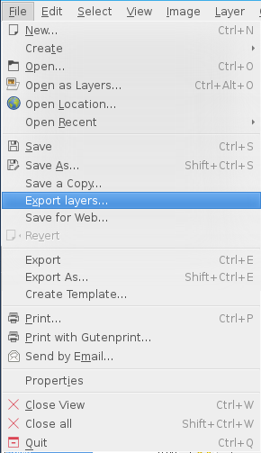
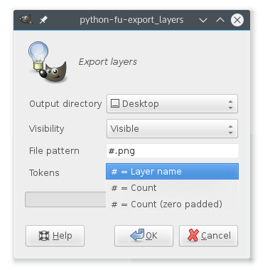

gimp-plug-ins
=============
###a collection of GIMP plug-ins.
As of now only one plug-in is ready - but it's pretty neat!

## Layer export
This plug-in will export your document's layers to the format specified in the *File pattern* field.
You can export the layers based on their visibility by toggling the *Visibility* drop-down.
In the *Token* drop-down you can choose what the *#* token in the *File pattern* field should be substituted with:
* `# = Layer name` will replace *#* with the layer name.
* `# = Count` will replace *#* with an increasing number for each layer.
* `# = Count (zero padded)` will replace *#* with an increasing number for each layer with zero padding - eg. `0001.png`.

Happy exporting!

| Screenshots|  |
| ------------- | ------------- |
|   |   |
| Puts itself into the *file* dialog  | The dialog for export options |

## Install
[The Gimp Wiki describes this pretty well](https://en.wikibooks.org/wiki/GIMP/Installing_Plugins#Copying_the_plugin_to_the_GIMP_plugin_directory)
To install the plug-in it's basically just copying the desired plug-in file to the Gimp plug-in directory.

### Quick Linux example
Gimp 2.8 plug-in folder is in `~/.gimp-2.8/plug-ins/`.
```
cd /path/to/gimp-plug-ins
cp export-layers.py ~/.gimp-2.8/plug-ins/
```
Now when you start Gimp the next time it should have loaded the plug-in.
